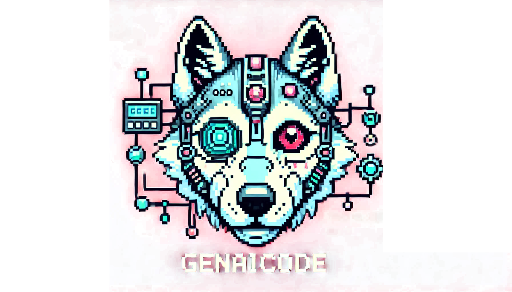

<p align="center">
  <picture>
    <source media="(prefers-color-scheme: dark)" srcset="media/logo-dark.png">
    <source media="(prefers-color-scheme: light)" srcset="media/logo.png">
    
  </picture>
</p>

# GenAIcode

GenAIcode is a small TypeScript toolkit for using LLMs in backend code.

It sits between raw provider SDKs and full agent frameworks: one prompt representation,
thin provider adapters, a convenient request API, and lightweight conversation chains.
It does not inspect repositories, execute shell commands, edit files, or run an agent UI.

## GenAIcode 2.0 is a new direction

GenAIcode 1.x was a coding agent. Version 2.0 deliberately replaces that product with a
small backend LLM toolkit: a jQuery-like layer for portable prompts, provider adapters,
conversation chains, and plugins.

The coding-agent CLI, browser UI, repository tools, shell execution, and agent
orchestration are not deprecated compatibility features; they have been removed from
2.0. The GenAIcode name, `PromptItem` model, provider converters, and extensibility
continue here in a smaller and more focused form.

The original coding agent remains available from the preserved
[`1.x` branch](https://github.com/gtanczyk/genaicode/tree/1.x) and the 1.x npm releases:

```bash
npx genaicode@1
```

Running `npx genaicode` with version 2.x prints this migration guidance instead of
starting the old agent.

See [the pivot plan](docs/pivot.md) for the full scope and migration decisions.

## Install

```bash
npm install genaicode
```

Node.js 20 or newer is required.

## A prompt in three lines

```ts
import { genaicode } from 'genaicode';
import { openai } from 'genaicode/providers';

const ai = genaicode(openai({ model: 'your-model-name' }));
const answer = await ai('Explain why the sky is blue in two sentences.').text();
```

The client is callable on purpose. Like jQuery, the common case starts with one small
function and becomes more specific through chaining:

```ts
const result = await ai('Create a release note from these commits')
  .system('You are a concise technical writer.')
  .temperature(0.2)
  .maxOutputTokens(500)
  .text();
```

Builders are immutable, so a configured base request can be safely reused.

## Chaining prompts

A chain remembers successful user and assistant turns. Each new prompt sees the complete
history:

```ts
import { system } from 'genaicode';

const chain = ai.chain(system('You are helping refine an API design.'));

const answer1 = await chain.text('Prompt 1: propose a minimal endpoint.');
const answer2 = await chain.text('Prompt 2: add idempotency to that design.');
const answer3 = await chain.text('Prompt 3: summarize the final contract.');
```

This is `prompt1 → response1 → prompt2 → response2 → prompt3 → response3`. The history
is available as portable `PromptItem[]` through `chain.history()`.

## Using a chain in a loop

A chain is ordinary application state, so normal control flow works:

```ts
const chain = ai.chain(system('Improve the draft while preserving its meaning.'));
let draft = 'The deployment had a problem and we fixed it.';

for (const instruction of ['Make it specific.', 'Make it concise.', 'Use a professional tone.']) {
  draft = await chain.text(`${instruction}\n\nCurrent draft:\n${draft}`);
}
```

Calls on one chain are serialized, even if application code starts them concurrently.
Failed provider calls are not added to history.

Validation and repair are also plain loops rather than a special agent abstraction:

```ts
import { parseJsonResult, resultText, system } from 'genaicode';

const repair = ai.chain(system('Return only valid JSON with a non-negative count.'));
let count: number | undefined;

for (let attempt = 1; attempt <= 3; attempt += 1) {
  const result = await repair.ask(
    attempt === 1 ? 'Count the actionable items in this text: ...' : 'Correct the previous response.',
  );

  try {
    const value = parseJsonResult<{ count: number }>(result);
    if (value.count < 0) throw new Error('count must be non-negative');
    count = value.count;
    break;
  } catch (error) {
    if (attempt === 3) throw error;
    console.warn('Invalid model response:', resultText(result));
  }
}
```

The application owns validation, attempt limits, and failure policy.

## PromptItem: the portable prompt IR

`PromptItem` is GenAIcode's provider-neutral intermediate representation:

```ts
import { image, prompt, system, toolResults, user } from 'genaicode';

const items = prompt(
  system('Return a one-sentence caption.'),
  user('Describe this image.', {
    images: [image(base64Png, 'image/png')],
  }),
  toolResults({
    callId: 'lookup-1',
    name: 'lookup',
    content: JSON.stringify({ locale: 'pl-PL' }),
  }),
);

const caption = await ai(items).text();
```

Applications can make domain objects prompt-aware without coupling them to a provider:

```ts
import { asPrompt, system, user } from 'genaicode';

const supportTicket = (ticket: Ticket) =>
  asPrompt(() => [system('Triage support tickets.'), user(JSON.stringify(ticket))]);

await ai(supportTicket(ticket)).text();
```

## Tools

```ts
const calls = await ai('What is the weather in Warsaw?')
  .tools([
    {
      name: 'weather',
      description: 'Get current weather',
      parameters: {
        type: 'object',
        properties: { city: { type: 'string' } },
        required: ['city'],
        additionalProperties: false,
      },
    },
  ])
  .toolCalls();
```

GenAIcode normalizes tool calls but deliberately does not execute them. The application
owns permissions, retries, and side effects.

## Providers

Models are provided in the adapter, through `.model(...)`, or with environment variables:

| Adapter                | Factory              | Environment defaults                                               |
| ---------------------- | -------------------- | ------------------------------------------------------------------ |
| OpenAI                 | `openai()`           | `OPENAI_API_KEY`, `OPENAI_MODEL`                                   |
| Anthropic              | `anthropic()`        | `ANTHROPIC_API_KEY`, `ANTHROPIC_MODEL`                             |
| Gemini API / AI Studio | `gemini()`           | `GEMINI_API_KEY` or `API_KEY`, `GEMINI_MODEL`                      |
| Vertex AI              | `vertexAI()`         | `GOOGLE_CLOUD_PROJECT`, `GOOGLE_CLOUD_LOCATION`, `VERTEX_AI_MODEL` |
| OpenAI-compatible      | `openaiCompatible()` | Explicit options; OpenAI defaults also work                        |

```ts
import { anthropic, gemini, openai, vertexAI } from 'genaicode/providers';

const viaOpenAI = genaicode(openai({ model: 'your-openai-model' }));
const viaClaude = genaicode(anthropic({ model: 'your-claude-model' }));
const viaGemini = genaicode(gemini({ model: 'your-gemini-model' }));
const viaVertex = genaicode(
  vertexAI({
    project: 'my-google-cloud-project',
    location: 'global',
    model: 'your-vertex-model',
  }),
);
```

Provider-specific options stay at provider construction. For example, Anthropic exposes
thinking and output-token defaults, while Gemini and Vertex expose SDK HTTP, auth, API
version, and generation configuration options.

GitHub Models, Ollama, vLLM, and other compatible gateways use the OpenAI-compatible
adapter:

```ts
import { openaiCompatible } from 'genaicode/providers';

const local = genaicode(
  openaiCompatible({
    name: 'local',
    baseURL: 'http://localhost:11434/v1',
    apiKey: 'local',
    model: 'qwen3',
  }),
);
```

Implementing a provider directly is intentionally small:

```ts
import type { ModelProvider } from 'genaicode';

const provider: ModelProvider = {
  name: 'internal-gateway',
  async generate(request) {
    // Convert request.prompt to your API and normalize the response.
    return { parts: [{ type: 'text', text: 'response' }] };
  },
};
```

All Anthropic, Google, and OpenAI conversion functions are public from
`genaicode/providers`, so gateways and tests can reuse them without instantiating clients.

## Plugins and hooks

A provider plugin no longer needs registration in global configuration. It exports the
same small `ModelProvider` contract as a built-in adapter:

```ts
// @acme/genaicode-bedrock
import type { ModelProvider } from 'genaicode';

export const bedrock = (options: BedrockOptions): ModelProvider => ({
  name: 'bedrock',
  async generate(request) {
    // Convert PromptItem[], call Bedrock, and return GenerationResult.
    return { parts: [{ type: 'text', text: 'response' }] };
  },
});
```

Hook-style plugins use middleware. They can observe or rewrite requests and results,
handle errors, implement caches or fallbacks, and intentionally short-circuit a call:

```ts
import { definePlugin, genaicode } from 'genaicode';
import { openai } from 'genaicode/providers';

const timing = definePlugin({
  name: 'timing',
  async generate(request, next) {
    const startedAt = performance.now();
    try {
      return await next(request);
    } finally {
      console.log('LLM request took', performance.now() - startedAt, 'ms');
    }
  },
});

const ai = genaicode(openai({ model: 'your-model-name' }), {
  plugins: [timing],
});
```

Plugins run in registration order, and each plugin may call `next()` once. This keeps the
extension mechanism compatible with npm packages and ordinary imports without restoring
the 1.x runtime TypeScript loader or process-global plugin registry.

## Design boundaries

- Backend library, not a coding agent.
- Provider-neutral core with no global configuration.
- Explicit models and credentials; environment variables are only provider defaults.
- Immutable request builders.
- Conversation history is explicit; loops remain ordinary application code.
- No hidden tool execution or hidden retries.
- Third-party providers and middleware use stable TypeScript contracts.
- Provider SDKs stay behind the `genaicode/providers` subpath.

See [the pivot plan](docs/pivot.md) for product scope, migration decisions, and the roadmap.
