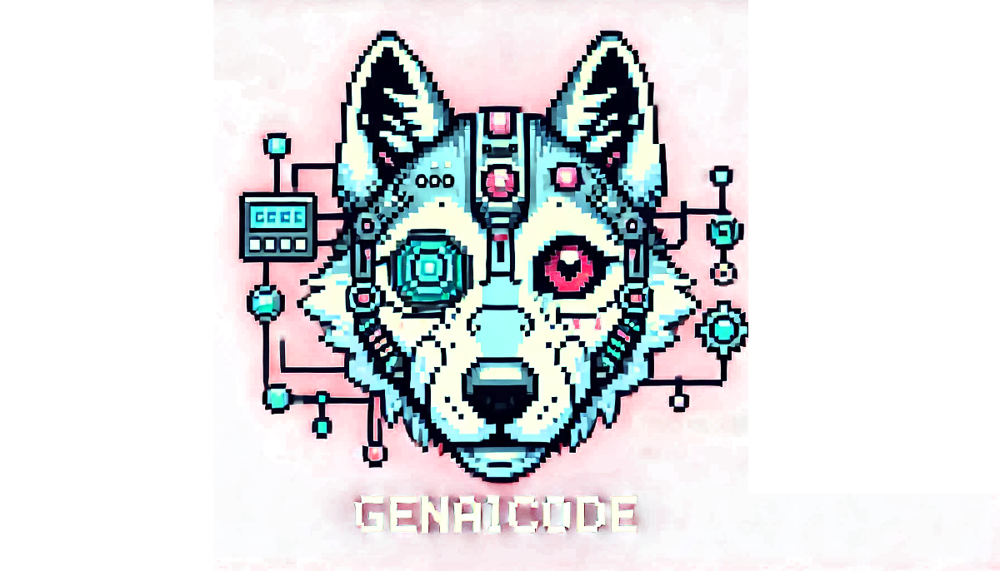
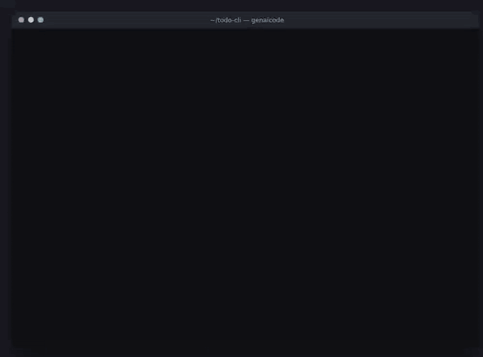
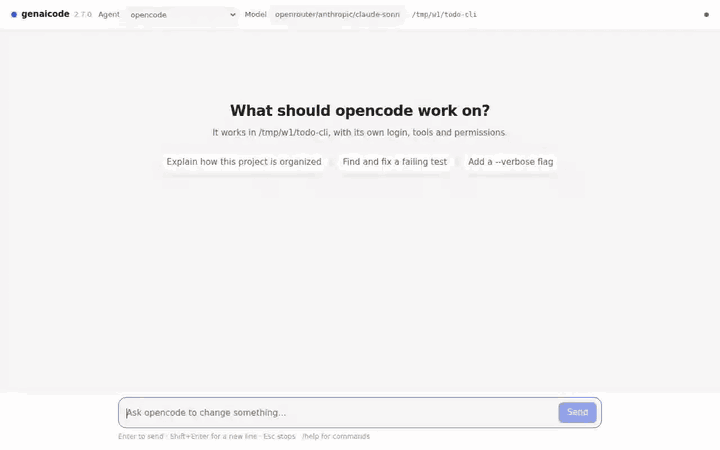
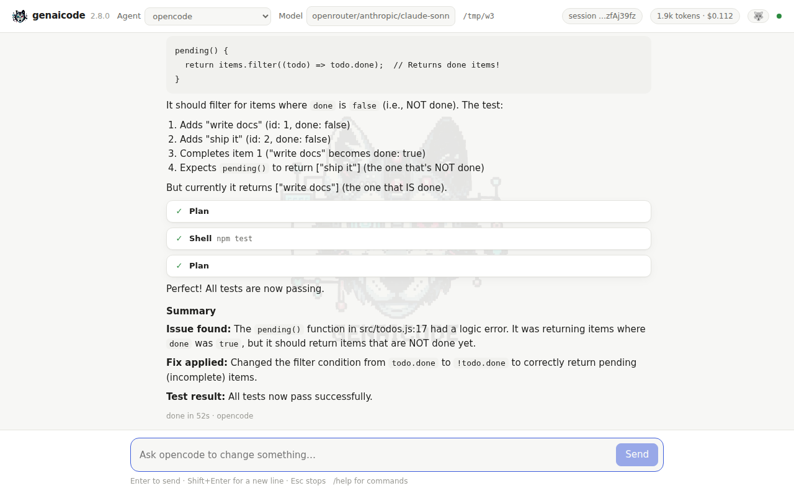
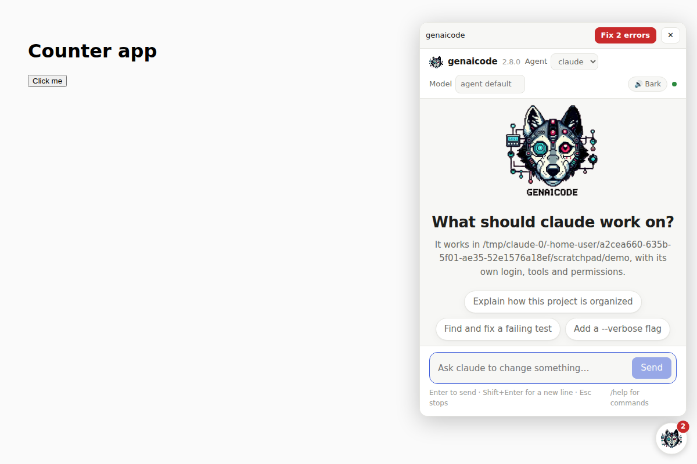

<p align="center">
  <picture>
    <source media="(prefers-color-scheme: dark)" srcset="media/logo-dark.png">
    <source media="(prefers-color-scheme: light)" srcset="media/logo.png">
    
  </picture>
</p>

# GenAIcode

GenAIcode is a small TypeScript toolkit for using LLMs in backend code.

It sits between raw provider SDKs and full agent frameworks: one prompt representation,
thin provider adapters, a convenient request API, and lightweight conversation chains.
The core does not inspect repositories, execute shell commands, edit files, or run an agent UI.
The opt-in [`genaicode/agents`](#coding-agents) subpath drives the coding-agent CLIs you
already have (Claude Code, Codex, GitHub Copilot CLI, Cursor, Gemini CLI, opencode, Muse,
Mistral Vibe, Antigravity) behind one task and event API, so you can orchestrate them from
backend code. The same drivers are on the command line as `npx genaicode run`.

**Like jQuery**, the common case starts with one small function and becomes more specific
through chaining—configure a request, follow up across multiple prompts, and keep history
portable without adopting a full agent framework.

GenAIcode 1.x was a coding agent; see [Migration from 1.x](#migration-from-1x) if you need
the old product or the 2.0 scope decisions.

## Install

```bash
npm install genaicode
```

Node.js 20 or newer is required.

## Why this vs a raw SDK

Provider SDKs are the right tool when you call one vendor and own every request shape
yourself. The cost shows up when the same backend needs a second provider, a test double,
or shared policy (timeouts, JSON parsing, rate limits, fallback) without copying glue.

GenAIcode is that thin shared layer:

- One portable prompt/tool IR (`PromptItem`) instead of OpenAI messages vs Anthropic
  blocks vs Gemini contents.
- One request API (`.text()`, `.json()`, `.stream()`, chains) over those adapters.
- A tiny `ModelProvider` seam so tests and custom gateways do not mock vendor HTTP.
- Opt-in middleware and retry helpers—no hidden tool runners, no silent retries, no
  agent loop.

If you are happy importing one SDK and never swapping models or providers, stay on the
SDK. If you want the call site to look the same while the edge stays replaceable, use
GenAIcode.

## A prompt in three lines

```ts
import { genaicode } from 'genaicode';
import { openai } from 'genaicode/providers';

const ai = genaicode(openai({ model: 'your-model-name' }));
const answer = await ai('Explain why the sky is blue in two sentences.').text();
```

The client is callable on purpose. Configuration is ordinary method chaining—system
instructions, temperature, token limits, and more—without a separate options object or
framework setup:

```ts
const result = await ai('Create a release note from these commits')
  .system('You are a concise technical writer.')
  .temperature(0.2)
  .maxOutputTokens(500)
  .text();
```

Builders are immutable, so a configured base request can be safely reused:

```ts
const releaseNote = ai('Create a release note from these commits')
  .system('You are a concise technical writer.')
  .temperature(0.2);

const short = await releaseNote.maxOutputTokens(200).text();
const long = await releaseNote.maxOutputTokens(800).text();
```

## Coding agents

`genaicode/agents` turns the coding-agent CLIs installed on a machine into one API. Give
any of them a task (a prompt and a working directory) and get back the same event stream
and result, whichever agent does the work. It is how you script, compare, or chain coding
agents from a job, a bot, or a CI step without writing a parser per vendor.

```ts
import { claude, codex, copilot, cursor, detectAgents } from 'genaicode/agents';

const [found] = detectAgents([claude(), codex(), copilot(), cursor()]).filter(({ path }) => path);
if (!found) throw new Error('No coding agent installed.');

const run = found.agent.run({ prompt: 'Add a unit test for parseDate', cwd: '/path/to/repo', timeoutMs: 20 * 60_000 });
for await (const event of run) {
  if (event.type === 'tool-start') console.log('⚙', event.name);
  if (event.type === 'file-change') console.log('edited', event.paths.join(', '));
}
const result = await run.result; // { status, ok, text, sessionId, usage, error, ... }
```

| Agent            | Driver                        | Extras                                     |
| ---------------- | ----------------------------- | ------------------------------------------ |
| Claude Code      | `claude()`                    | MCP servers, max turns, effort, cost       |
| Codex            | `codex()`, `codexLive()`      | MCP servers; live: `steer()`, approvals    |
| GitHub Copilot   | `copilot()`                   | MCP servers, allow/deny tool patterns      |
| Cursor           | `cursor()`                    | streamed text deltas                       |
| Gemini CLI       | `gemini()`                    | approval mode                              |
| opencode         | `opencode()`                  | `provider/model` ids, variants             |
| Mistral Vibe     | `vibe()`                      | agent profile, max turns, max price        |
| Antigravity CLI  | `antigravity()`               | sandbox, effort, usage                     |
| Muse             | `muse()`, `museLive()`        | max turns; live: `steer()`, approvals      |
| Your own CLI/API | `cliAgent()`, `hostedAgent()` | plug in any JSON-lines CLI or hosted agent |

On top of the drivers:

- **Steer a running task** with `run.steer(text)`, and answer permission prompts with
  `onApproval` (live drivers).
- **Attach MCP servers per task** with `mcpServers`. Header secrets stay out of argv.
- **Verify and repair**: `runWithVerify` runs your check (tests, lint) after the agent and
  sends failures back for another attempt.
- **Keep credentials apart**: `withoutProviderCredentials()` strips your app's LLM API keys
  from the agent's environment, so it bills its own login.

Importing `genaicode` never spawns anything; only `genaicode/agents` does. The agent uses
its own credentials, billing, and permission settings. GenAIcode does not sandbox it,
choose a model, or retry it. See [docs/agents.md](docs/agents.md) for events, options per
driver, and writing your own driver.

### From the command line

The `genaicode` bin runs the same headless drivers without writing any code:

```bash
npx genaicode agents                                   # which agent CLIs are installed
npx genaicode run "Add a unit test for parseDate"      # first installed agent, current dir
npx genaicode run -a codex -C ../api --verify "npm test" "Fix the failing date tests"
git diff | npx genaicode run --json -a claude -        # prompt from stdin, JSON-lines events
```

Assistant text goes to stdout and tool calls, edits, and the result line go to stderr.
`--verify` runs a shell command after the agent finishes and sends its output back for up
to `--max-repairs` more attempts (`runWithVerify`). The exit code is 0 on success, 1 when
the agent or the check fails, 2 on a usage error, and 130 when interrupted.
`npx genaicode --help` lists every option.

### Chat with an agent: terminal and browser

```bash
npx genaicode                      # chat in this terminal (same as "genaicode chat")
npx genaicode chat -a claude -C ../api
npx genaicode ui                   # the same chat in your browser, served on 127.0.0.1
```

Each prompt after the first continues the agent's own session (`AgentTask.resume`), so you
can say "now add a test for that". Prompts sent while the agent works wait in a queue and
run next; Esc stops the agent. `/agent`, `/model` and `/new` switch agent, model and
session; `/help` lists the rest.

<p align="center">
  <picture>
    <source media="(prefers-reduced-motion: reduce)" srcset="media/screenshots/chat-terminal.png">
    
  </picture>
  <picture>
    <source media="(prefers-reduced-motion: reduce) and (prefers-color-scheme: dark)" srcset="media/screenshots/wolf-dark.png">
    <source media="(prefers-reduced-motion: reduce)" srcset="media/screenshots/wolf-light.png">
    <source media="(prefers-color-scheme: dark)" srcset="media/screenshots/chat-browser-dark.gif">
    <source media="(prefers-color-scheme: light)" srcset="media/screenshots/chat-browser-light.gif">
    
  </picture>
</p>

The wolf from genaicode 1.0 is back. When the agent asks for approval or finishes, the
browser UI barks if its tab is in the background and counts those events in the tab title.
The terminal UI rings the terminal bell instead. `/bark off` (or the Bark button) quiets it.

<p align="center">
  <picture>
    <source media="(prefers-color-scheme: dark)" srcset="media/screenshots/wolf-dark.png">
    <source media="(prefers-color-scheme: light)" srcset="media/screenshots/wolf-light.png">
    
  </picture>
</p>

`genaicode ui` listens on the loopback address and prints a link with a random access
token. The page, the event stream and every command need that token; only the bundled
script and the four mascot files (`/app.js`, `/assets/…`) are served without it, since they
hold nothing about your session. Both front ends are bundled into the package and load
only for these commands; importing `genaicode` or `genaicode/agents` pulls in no UI code.
In code, the same conversation is `createAgentSession` from `genaicode/agents` (see
[docs/agents.md](docs/agents.md#chat-sessions)); with a live driver (`codexLive`,
`museLive`) it also steers the running agent and asks you about permission requests.

### Inside a Vite app

```ts
// vite.config.ts
import { defineConfig } from 'vite';
import genaicode from 'genaicode/vite';

export default defineConfig({ plugins: [genaicode()] });
```

<p align="center">
  <picture>
    <source media="(prefers-color-scheme: dark)" srcset="media/screenshots/vite-dark.png">
    <source media="(prefers-color-scheme: light)" srcset="media/screenshots/vite-light.png">
    
  </picture>
</p>

In `vite dev`, the app gets the wolf in its corner. It opens the same chat as `genaicode ui`
in a panel, with the agent working in the project root. The wolf counts the page's errors
(build errors, uncaught exceptions, unhandled rejections, `console.error`), and "Fix N
errors" sends them to the agent as one prompt. Options: `agent`, `model`, `effort`,
`approveAll`, `agents`, `port`, and `captureErrors: false` to leave the page's errors alone.
Builds are untouched. The chat runs on its own port on 127.0.0.1 even when Vite runs with
`--host`, lets only the app's origins frame it, and hands its token (and takes "fix" requests)
only from the app's own pages on this machine.

### In your own React app

`genaicode/react` is the same chat as a component. It draws a `SessionState` your app gives
it and calls you back; it runs, fetches and stores nothing, so your server owns the session,
its MCP servers and its prompts. React 18 or newer comes from your app: genaicode does not
declare or install it.

```ts
// server (Node): one session, streamed to the page
import { createAgentSession, claude } from 'genaicode/agents';

const session = createAgentSession({
  agent: claude(),
  cwd: process.cwd(),
  task: { mcpServers: [{ name: 'ops', url: 'http://127.0.0.1:4000/mcp' }] },
  // The agent gets the context; the transcript keeps what the user typed.
  transformPrompt: (text) => `${briefing}\n\nOperator message:\n${text}`,
});

app.get('/api/agent/events', (req, res) => {
  res.writeHead(200, { 'content-type': 'text/event-stream', 'cache-control': 'no-store' });
  const push = (state) => res.write(`data: ${JSON.stringify(state)}\n\n`);
  push(session.get());
  res.on('close', session.subscribe(push));
});
app.post('/api/agent/send', (req, res) => {
  session.send(req.body.text);
  res.json({ ok: true });
});
app.post('/api/agent/stop', (req, res) => {
  session.stop();
  res.json({ ok: true });
});
app.post('/api/agent/approve', (req, res) => res.json({ ok: session.approve(req.body.id, req.body.decision) }));
```

```tsx
// page
import { useEffect, useState } from 'react';
import { AgentChat, type SessionState } from 'genaicode/react';
import 'genaicode/react/styles.css';

const post = (path: string, body: object = {}) =>
  fetch(path, { method: 'POST', headers: { 'content-type': 'application/json' }, body: JSON.stringify(body) });

export function AgentDrawer() {
  const [state, setState] = useState<SessionState | null>(null);
  useEffect(() => {
    const events = new EventSource('/api/agent/events');
    events.onmessage = (event) => setState(JSON.parse(event.data));
    return () => events.close();
  }, []);
  return (
    <AgentChat
      state={state}
      onSend={(text) => post('/api/agent/send', { text })}
      onStop={() => post('/api/agent/stop')}
      onApprove={(id, decision) => post('/api/agent/approve', { id, decision })}
      formatToolName={(name) => name.replace(/^mcp__ops__/, '')}
      renderFooter={() => <MyApprovalCards />}
      headerExtras={<button onClick={() => post('/api/agent/reset')}>New</button>}
    />
  );
}
```

`<AgentChat>` fills its container's height. It shows turns with streaming Markdown (no raw
HTML; links open in a new tab), collapsible tool calls, edited files, errors, the agent's
own approval requests, queued prompts and a working indicator, and an input where Enter
sends, Shift+Enter adds a line and Esc stops. Props:

| Prop                                                                           |                                                                  |
| ------------------------------------------------------------------------------ | ---------------------------------------------------------------- |
| `state`                                                                        | `SessionState`, or null before there is a session                |
| `onSend(text)`, `onStop()`                                                     | Enter or Send; Stop or Esc. No `onStop`, no Stop button          |
| `onApprove(id, decision)`                                                      | answers `state.approvals`; without it they show as waiting       |
| `renderPrompt(text, turn?)`                                                    | how a sent prompt shows (return null to hide it)                 |
| `renderAfterTurn(turn, i)`, `renderFooter()`                                   | your content after a turn, or at the end                         |
| `notices`                                                                      | `{ id, afterTurn, text, tone? }[]`: your own lines between turns |
| `header`, `headerExtras`                                                       | replace the header (null for none), or add to its right end      |
| `emptyState`, `placeholder`, `hint`                                            | text before the first turn, in and under the input               |
| `formatToolName(name)`, `disabled`, `autoFocus`, `theme`, `className`, `style` |                                                                  |

Theme it with CSS custom properties on the component or any ancestor: `--gc-bg`,
`--gc-panel`, `--gc-border`, `--gc-text`, `--gc-muted`, `--gc-accent`, `--gc-accent-text`,
`--gc-error`, `--gc-font`, `--gc-mono`, `--gc-font-size`, `--gc-radius`, `--gc-max-width`
(and `--gc-ok`, `--gc-warn`, plus soft shades mixed from these unless set). Unset ones keep
the `genaicode ui` look, light or dark by `prefers-color-scheme`, or by `theme="light"` /
`"dark"`. `genaicode ui` and the Vite panel draw this same component.

To show the whole `genaicode ui` page in a frame instead, `startEmbeddedWeb` from
`genaicode/ui` serves it on 127.0.0.1 with your `task` (`mcpServers`, `timeoutMs`...), `env`
and `transformPrompt`, and returns its tokenized `url` and a `controller` to send prompts.

## Chaining prompts

A chain remembers successful user and assistant turns. Each new prompt sees the complete
history, so multi-step work stays in ordinary application code:

```ts
import { system } from 'genaicode';

const chain = ai.chain(system('You are helping refine an API design.'));

const answer1 = await chain.text('Prompt 1: propose a minimal endpoint.');
const answer2 = await chain.text('Prompt 2: add idempotency to that design.');
const answer3 = await chain.text('Prompt 3: summarize the final contract.');
```

This is `prompt1 → response1 → prompt2 → response2 → prompt3 → response3`. The history
is available as portable `PromptItem[]` through `chain.history()`.

## Using a chain in a loop

A chain is ordinary application state, so normal control flow works:

```ts
const chain = ai.chain(system('Improve the draft while preserving its meaning.'));
let draft = 'The deployment had a problem and we fixed it.';

for (const instruction of ['Make it specific.', 'Make it concise.', 'Use a professional tone.']) {
  draft = await chain.text(`${instruction}\n\nCurrent draft:\n${draft}`);
}
```

Calls on one chain are serialized, even if application code starts them concurrently.
Failed provider calls are not added to history.

Validation and repair are also plain loops rather than a special agent abstraction:

```ts
import { parseJsonResult, resultText, system } from 'genaicode';

const repair = ai.chain(system('Return only valid JSON with a non-negative count.'));
let count: number | undefined;

for (let attempt = 1; attempt <= 3; attempt += 1) {
  const result = await repair.ask(
    attempt === 1 ? 'Count the actionable items in this text: ...' : 'Correct the previous response.',
  );

  try {
    const value = parseJsonResult<{ count: number }>(result);
    if (value.count < 0) throw new Error('count must be non-negative');
    count = value.count;
    break;
  } catch (error) {
    if (attempt === 3) throw error;
    console.warn('Invalid model response:', resultText(result));
  }
}
```

The application owns validation, attempt limits, and failure policy.

## Schema adapters

`json(...)` and `parseJsonResult(...)` accept either a parser function or a schema adapter
with a `parse(value)` method. This keeps schema validation library-agnostic:

```ts
const value = await ai('Return {"count": 3}.').json({
  parse(input) {
    if (typeof input !== 'object' || input === null || typeof input.count !== 'number') {
      throw new Error('Invalid shape');
    }
    return input;
  },
});
```

Calling `.json()` also sets `responseFormat: { type: 'json' }` on the request when you have
not already chosen a format, so providers that support JSON mode (OpenAI, Gemini/Vertex)
are asked for JSON rather than free text.

## Response format and thinking

Portable request fields cover the two knobs backends usually poke through provider-specific
config:

```ts
const verdict = await ai(promptText)
  .responseFormat({ type: 'json' })
  .thinking({ level: 'minimal' }) // or { budgetTokens: 0 } / false to disable
  .temperature(0)
  .json((value) => VerdictSchema.parse(value));
```

- `responseFormat`: `{ type: 'text' | 'json' }` or
  `{ type: 'json_schema', name, schema, strict? }`.
- `thinking`: `false` to disable, or `{ budgetTokens?, level? }` (`minimal` |
  `low` | `medium` | `high`). Prefer one of budget or level — some providers reject both.
  On Google/Gemini, `false` and `budgetTokens: 0` map to `thinkingLevel: MINIMAL`
  (or `LOW` for models like Gemini 3.7 and Gemini 3 Pro where `MINIMAL` is unsupported)
  because Gemini 3 rejects `thinkingBudget: 0`. JSON `responseFormat` without an
  explicit `thinking` setting or provider `generationConfig.thinkingConfig` default also
  defaults Google thinking to `MINIMAL` (or `LOW` on Gemini 3.7 / Pro).
  On Anthropic, `level` becomes `output_config.effort` with adaptive thinking (Opus and
  Sonnet 4.6+), and `false` uses whatever the model accepts: `disabled`, `between_tools`
  (Sonnet 5.5), or effort `low` where thinking is always on (Opus 5.5, Fable). Budgets
  become adaptive thinking on models that removed them.

Providers map what they support and ignore the rest. `ProviderCapabilities.jsonResponse`
and `ProviderCapabilities.thinking` advertise support. Vendor-specific escapes such as
Vertex `generationConfig` remain available for anything not covered here.

## PromptItem: the portable prompt IR

`PromptItem` is GenAIcode's provider-neutral intermediate representation:

```ts
import { image, prompt, system, toolResults, user } from 'genaicode';

const items = prompt(
  system('Return a one-sentence caption.'),
  user('Describe this image.', {
    images: [image(base64Png, 'image/png')],
  }),
  toolResults({
    callId: 'lookup-1',
    name: 'lookup',
    content: JSON.stringify({ locale: 'pl-PL' }),
  }),
);

const caption = await ai(items).text();
```

Applications can make domain objects prompt-aware without coupling them to a provider:

```ts
import { asPrompt, system, user } from 'genaicode';

const supportTicket = (ticket: Ticket) =>
  asPrompt(() => [system('Triage support tickets.'), user(JSON.stringify(ticket))]);

await ai(supportTicket(ticket)).text();
```

## Tools

```ts
const calls = await ai('What is the weather in Warsaw?')
  .tools([
    {
      name: 'weather',
      description: 'Get current weather',
      parameters: {
        type: 'object',
        properties: { city: { type: 'string' } },
        required: ['city'],
        additionalProperties: false,
      },
    },
  ])
  .toolCalls();
```

GenAIcode normalizes tool calls but deliberately does not execute them. The application
owns permissions, retries, and side effects.

## Streaming

Providers that support native streaming expose a provider-neutral `StreamEvent` IR.
Request builders and chains offer `.stream()` and `.streamText()`. If a provider has no
`stream` method, GenAIcode synthesizes a short stream from `generate`.

```ts
for await (const event of ai('Write a haiku about queues.').stream()) {
  if (event.type === 'text-delta') process.stdout.write(event.text);
  if (event.type === 'done') console.log('\n', event.result.usage);
}
```

Built-in adapters declare capability metadata:

```ts
ai.provider.capabilities;
// { streaming: true, tools: true, images: 'input', systemPrompt: true }
```

## Middleware

Hook-style plugins remain the extension point. Built-in helpers cover common backend
needs without restoring a global registry:

```ts
import { cachePlugin, fallbackPlugin, genaicode, rateLimitPlugin, timingPlugin } from 'genaicode';
import { anthropic, openai } from 'genaicode/providers';

const ai = genaicode(openai({ model: 'your-model-name' }), {
  plugins: [
    timingPlugin(),
    rateLimitPlugin({ concurrency: 2, minIntervalMs: 50 }),
    cachePlugin({ maxEntries: 64 }),
    fallbackPlugin({ providers: [anthropic({ model: 'your-claude-model' })] }),
  ],
});
```

## Retries

Retries stay in application code. Use `classifyError`, `isRetryable`, and `withRetry`
when you want shared classification without hidden policy:

```ts
import { withRetry } from 'genaicode';

const text = await withRetry(() => ai('Summarize the deploy notes.').text(), {
  attempts: 3,
  delayMs: 250,
});
```

See [retry guidance](docs/retry.md), [semver policy](docs/semver.md), and the
[provider package evaluation](docs/provider-packages.md).

## Providers

Models are provided in the adapter, through `.model(...)`, or with environment variables:

| Adapter                | Factory              | Environment defaults                                               |
| ---------------------- | -------------------- | ------------------------------------------------------------------ |
| OpenAI                 | `openai()`           | `OPENAI_API_KEY`, `OPENAI_MODEL`                                   |
| Anthropic              | `anthropic()`        | `ANTHROPIC_API_KEY`, `ANTHROPIC_MODEL`                             |
| Gemini API / AI Studio | `gemini()`           | `GEMINI_API_KEY` or `API_KEY`, `GEMINI_MODEL`                      |
| Vertex AI              | `vertexAI()`         | `GOOGLE_CLOUD_PROJECT`, `GOOGLE_CLOUD_LOCATION`, `VERTEX_AI_MODEL` |
| OpenAI-compatible      | `openaiCompatible()` | Explicit options; OpenAI defaults also work                        |

```ts
import { anthropic, gemini, openai, vertexAI } from 'genaicode/providers';

const viaOpenAI = genaicode(openai({ model: 'your-openai-model' }));
const viaClaude = genaicode(anthropic({ model: 'your-claude-model' }));
const viaGemini = genaicode(gemini({ model: 'your-gemini-model' }));
const viaVertex = genaicode(
  vertexAI({
    project: 'my-google-cloud-project',
    location: 'global',
    model: 'your-vertex-model',
  }),
);
```

Provider-specific options stay at provider construction. For example, Anthropic exposes
thinking and output-token defaults, while Gemini and Vertex expose SDK HTTP, auth, API
version, and generation configuration options.

GitHub Models, Ollama, vLLM, and other compatible gateways use the OpenAI-compatible
adapter:

```ts
import { openaiCompatible } from 'genaicode/providers';

const local = genaicode(
  openaiCompatible({
    name: 'local',
    baseURL: 'http://localhost:11434/v1',
    apiKey: 'local',
    model: 'qwen3',
  }),
);
```

Implementing a provider directly is intentionally small:

```ts
import type { ModelProvider } from 'genaicode';

const provider: ModelProvider = {
  name: 'internal-gateway',
  async generate(request) {
    // Convert request.prompt to your API and normalize the response.
    return { parts: [{ type: 'text', text: 'response' }] };
  },
};
```

All Anthropic, Google, and OpenAI conversion functions are public from
`genaicode/providers`, so gateways and tests can reuse them without instantiating clients.

## Provider E2E tests

Run real-provider E2E tests locally with:

```bash
npm run test:e2e
```

These tests are credential-gated and run only when provider-specific environment variables
are set:

- OpenAI: `OPENAI_API_KEY`, `OPENAI_MODEL`
- Anthropic: `ANTHROPIC_API_KEY`, `ANTHROPIC_MODEL`
- Gemini: `GEMINI_API_KEY`, `GEMINI_MODEL`

Beyond the smoke call, E2E also covers portable `responseFormat: { type: 'json' }`
(OpenAI, Gemini) and `thinking` (Anthropic disable; Gemini disable / `level: 'minimal'`).

CI/CD is configured in `.github/workflows/provider-e2e.yaml`. Each provider runs in its own
job and only starts when both required secrets are configured in GitHub Actions.

## Plugins and hooks

A provider plugin no longer needs registration in global configuration. It exports the
same small `ModelProvider` contract as a built-in adapter:

```ts
// @acme/genaicode-bedrock
import type { ModelProvider } from 'genaicode';

export const bedrock = (options: BedrockOptions): ModelProvider => ({
  name: 'bedrock',
  capabilities: { streaming: false, tools: true, systemPrompt: true },
  async generate(request) {
    // Convert PromptItem[], call Bedrock, and return GenerationResult.
    return { parts: [{ type: 'text', text: 'response' }] };
  },
});
```

Hook-style plugins use middleware. They can observe or rewrite requests and results,
handle errors, implement caches or fallbacks, and intentionally short-circuit a call.
Optional `stream` middleware follows the same registration order.

```ts
import { definePlugin, genaicode } from 'genaicode';
import { openai } from 'genaicode/providers';

const timing = definePlugin({
  name: 'timing',
  async generate(request, next) {
    const startedAt = performance.now();
    try {
      return await next(request);
    } finally {
      console.log('LLM request took', performance.now() - startedAt, 'ms');
    }
  },
});

const ai = genaicode(openai({ model: 'your-model-name' }), {
  plugins: [timing],
});
```

Plugins run in registration order, and each plugin may call `next()` once. This keeps the
extension mechanism compatible with npm packages and ordinary imports without restoring
the 1.x runtime TypeScript loader or process-global plugin registry.

Framework-shaped examples live under `examples/` (`http-handler`, `queue-worker`,
`cron-job`).

## Design boundaries

- Backend library, not a coding agent. `genaicode/agents` drives external agent CLIs; it
  adds no agent loop, prompts, or repository tools of its own.
- Provider-neutral core with no global configuration.
- Explicit models and credentials; environment variables are only provider defaults.
- Immutable request builders.
- Conversation history is explicit; loops remain ordinary application code.
- No hidden tool execution or hidden retries.
- Third-party providers and middleware use stable TypeScript contracts.
- Provider SDKs stay behind the `genaicode/providers` subpath; process spawning stays
  behind `genaicode/agents`.

## Migration from 1.x

GenAIcode 1.x was a coding agent. Version 2.0 deliberately replaces that product with a
small backend LLM toolkit: a jQuery-like layer for portable prompts, provider adapters,
conversation chains, and plugins.

The 1.x coding agent, browser UI, repository tools, and shell execution are not
deprecated compatibility features; they have been removed from 2.0. The 2.x
`genaicode` command only drives external agent CLIs (see [From the command line](#from-the-command-line)). The GenAIcode name, `PromptItem` model, provider converters, and extensibility
continue here in a smaller and more focused form.

The original coding agent remains available from the preserved
[`1.x` branch](https://github.com/gtanczyk/genaicode/tree/1.x) and the 1.x npm releases:

```bash
npx genaicode@1
```

In 2.x, `npx genaicode` opens a chat with the coding-agent CLIs you have installed
(Claude Code, Codex, opencode...) instead of the 1.x built-in agent.

See [the pivot plan](docs/pivot.md) for the full scope, migration decisions, and the
roadmap.
