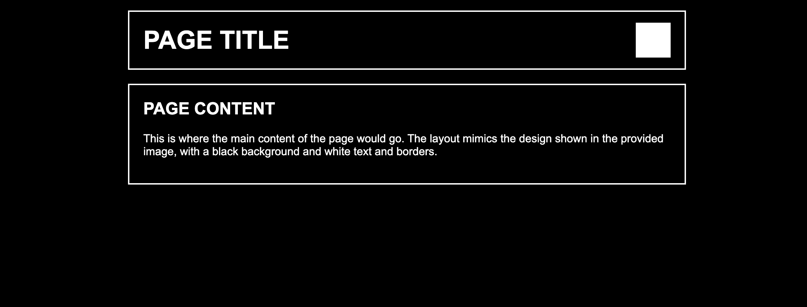
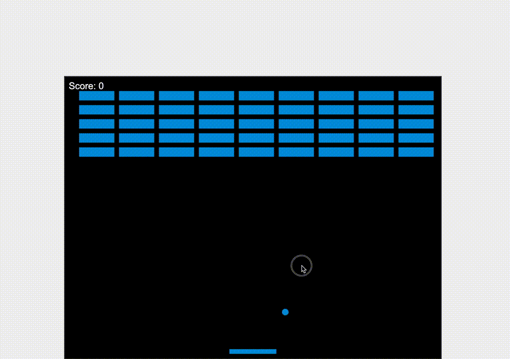
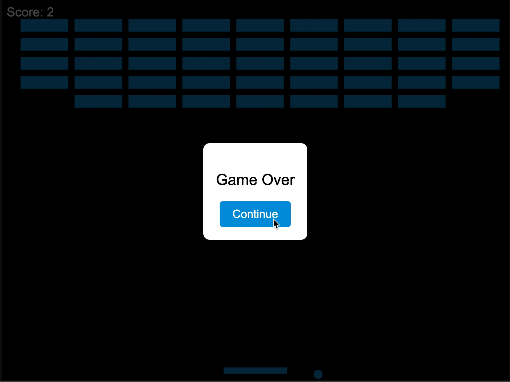

# Examples

Examples of applications generated entirely with `npx genaicode`:

## [Python Hello World App](./python_hello_world)

This example demonstrates usage of `--task-file` feature:

- first command:
  ```bash
  npx genaicode --task-file="tasks/create_python_hw_app_task.md"
  ```
- second command:
  ```bash
  npx genaicode --task-file="tasks/use_virtualenv.md"
  ```

## [Golang Hello World App](./golang_hello_world/)

It was generated using the `--explicit-prompt` option:

- first command:
  ```bash
  npx genaicode --explicit-prompt="Create an example hello world application using golang, including README with instructions how to compile it and run it"
  ```
- second command:
  ```bash
  npx genaicode --explicit-prompt="I want the Hello, World! text to be colored"
  ```

## [Java Hello World App](./java_hello_world/)

```bash
npx genaicode --explicit-prompt="similar to golang_hello_world, and python_hello_world, create an example java hello world application"
```

## [Vision Example](./vision_example/)

This example demonstrates vision capabilities, takes a sketch of a web page, and asks for generation of the page accordingly to the sketch:

```bash
npx genaicode --task-file="./vision_task.md" --vertex-ai-claude --vision --dry-run
```

| Sketch                                                   | Result                                                                                  |
| -------------------------------------------------------- | --------------------------------------------------------------------------------------- |
|  | <br/><br/><br/><br/><br/><br/> |
|                                                          |                                                                                         |

## [Arcanoid Game](./arcanoid_game/)

- first iteration:

```bash
npx genaicode --vertex-ai-claude --explicit-prompt="Please create a simple arcanoid game"
```

- result: simple game is created, it is using html and plain js

   

- second iteration: Replace window.alert with html based messages

  ```bash
  npx genaicode --vertex-ai-claude --explicit-prompt="Instead of using window.alert to show messages, show them using HTML, and pause the game when a message is shown. Allow user to confirm the message to continue"
  ```

- result: window.alert is replaced with nice html based image

  

## [Image Operations](./image-operations/)

An example that demonstrates the image generation/editing capabilities.

Commands:

```bash
npx genaicode --task-file="1_triangle.md" --imagen=vertex-ai
npx genaicode --task-file="2_remove_background.md"
npx genaicode --task-file="3_genai_edit_image.md" --imagen=dall-e
npx genaicode --task-file="4_split_image.md" --vision
```
